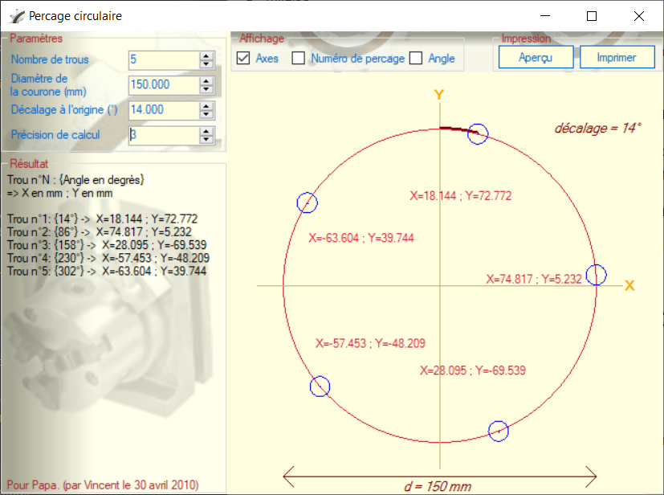
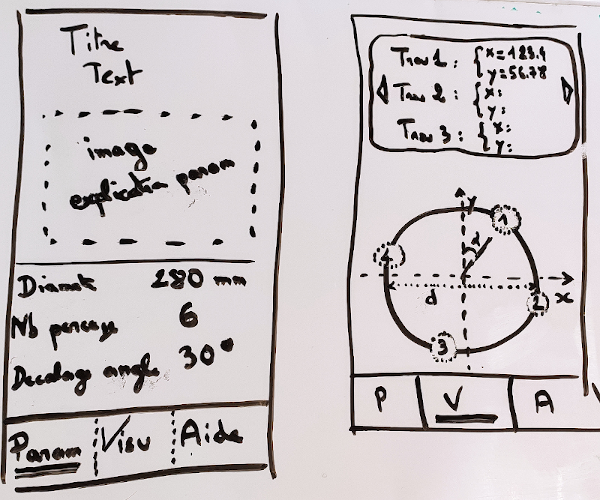

# Holing 

This is a simple helper for a milling machine.\
You have a visualization to display the coordinates {x,y} and you want the coordinates to do N holes equally distributed on a circle.

## Maths

```
angle1= 1 * 360/N
angle2= 2 * 360/N
...
x = diameter/ 2 * Cos(angle * PI / 180);
y = diameter/ 2 * Sin(angle * PI / 180);
```

## History (2010)

This was a small present for my father in 2010. He is still using it so let's give it an upgrade.\
Old application was a windows program in .net with windows.Form\
My father is keeping a computer in the heavy machine room to use it at the same time he works.



## New version (2021)

Let's make a new app also for his birthday!

## Constraints
 
- Should work on android phone + tablet.
- Accessible: easy to input (big finger)
- Accessible: easy to read (low sight)
- Accessible: simple (no complex swipe or multiple panels). 
- Accessible: can be use when put on the drilling machine.
- Unit should be in mm + degrees. Precision should be 1 micrometer.

## Tech

The choice was between:
- angular + cordova
- unity 

Angular would probably be easier for me, but I can do unity with my wife.

## Design



### General layout 

3 screens:
- Parameters (home page + short explain + input parameters)
- Visualization/Math/Result (show the result for given parameters)
- Help/More ... (some context, copyright, Probably the method to calculate the same thing on a calculator)

Switch from a screen to another with the bottom part of the screen.\
Current screen selection has specific style.

### Param input screen

_(see image: left part)_

This is the welcome page, so it should present a short explanation.\

```
I am drilling 6 holes distributed on a circle of diameter 280mm.
What are the coordinates?
```

In addition to the text, an image seems mandatory to explain the parameters, axis direction...\
And the input parameters:
- Diameter. In mm. Unsigned float. 0< d <10000.
- Number of holes. Unsigned integer  1<= nb <=999. Usually <12.
- Angular tilt. In degrees. Unsigned float. 0<= alpha < (360/NbHoles) . Instead of starting at the top in {x=0;y=d/2}, start with a different angle. E.g. if angle=90, first coordinate is {x=d/2;y=0}.

### Result screen 

_(see image: right part)_

Top part is showing each coordinates (in a large font size). A pagination is available when many holes.\
Bottom part is a schema:
- remind axes names and direction
- show diameter
- show angular tilt (if not 0)
- show coordinates {0;0} at the center of the circle?
- show holes positions (if hole is visible in the top part, use a special style)
- touching a hole will update the top part to display these coordinates.

### Help screen 

//TODO

## MIT License

```
Copyright (c) 

Permission is hereby granted, free of charge, to any person obtaining a copy
of this software and associated documentation files (the "Software"), to deal
in the Software without restriction, including without limitation the rights
to use, copy, modify, merge, publish, distribute, sublicense, and/or sell
copies of the Software, and to permit persons to whom the Software is
furnished to do so, subject to the following conditions:

The above copyright notice and this permission notice shall be included in all
copies or substantial portions of the Software.

THE SOFTWARE IS PROVIDED "AS IS", WITHOUT WARRANTY OF ANY KIND, EXPRESS OR
IMPLIED, INCLUDING BUT NOT LIMITED TO THE WARRANTIES OF MERCHANTABILITY,
FITNESS FOR A PARTICULAR PURPOSE AND NONINFRINGEMENT. IN NO EVENT SHALL THE
AUTHORS OR COPYRIGHT HOLDERS BE LIABLE FOR ANY CLAIM, DAMAGES OR OTHER
LIABILITY, WHETHER IN AN ACTION OF CONTRACT, TORT OR OTHERWISE, ARISING FROM,
OUT OF OR IN CONNECTION WITH THE SOFTWARE OR THE USE OR OTHER DEALINGS IN THE
SOFTWARE.
```
